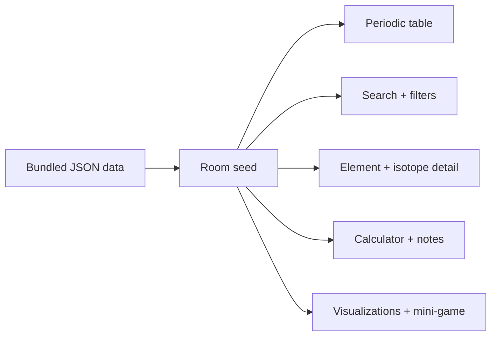
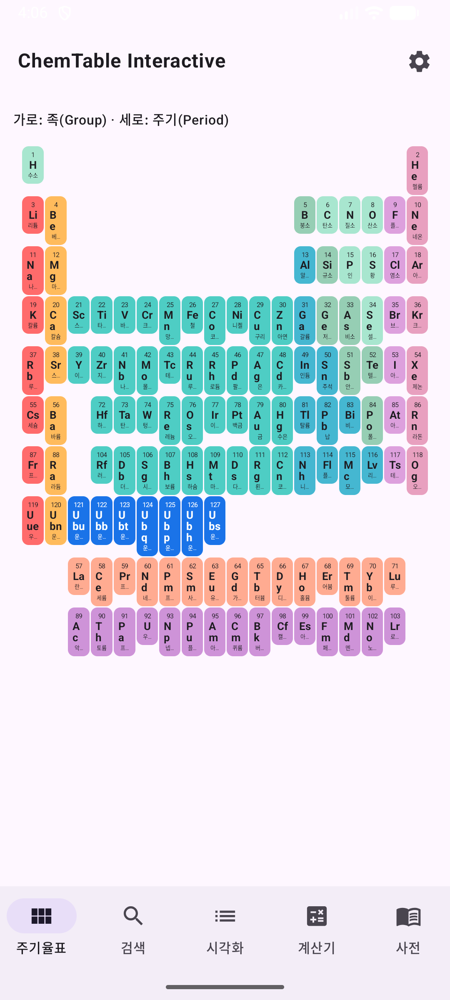
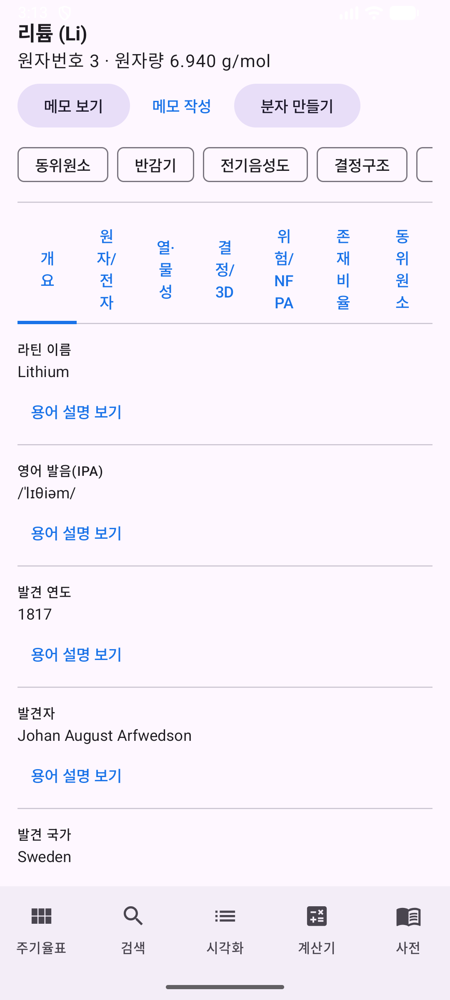
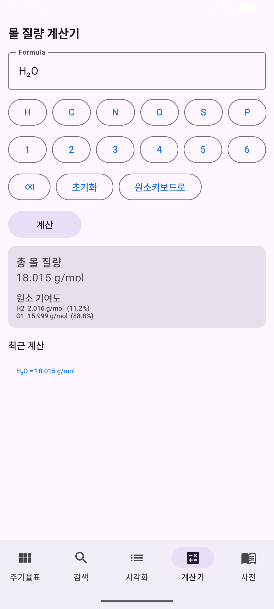
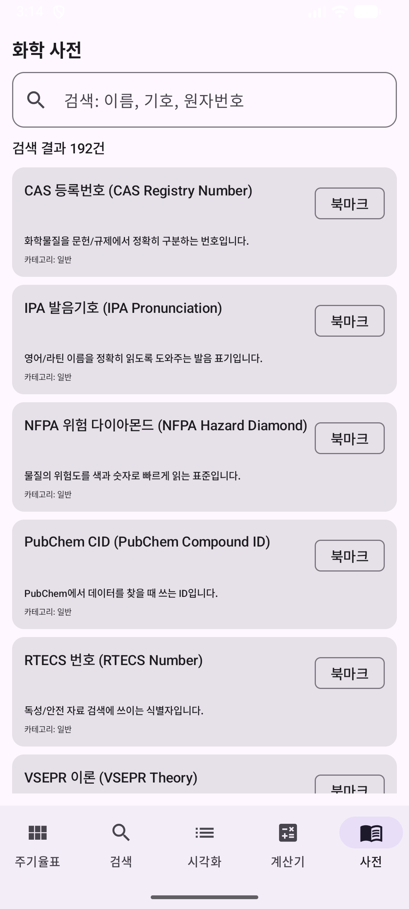
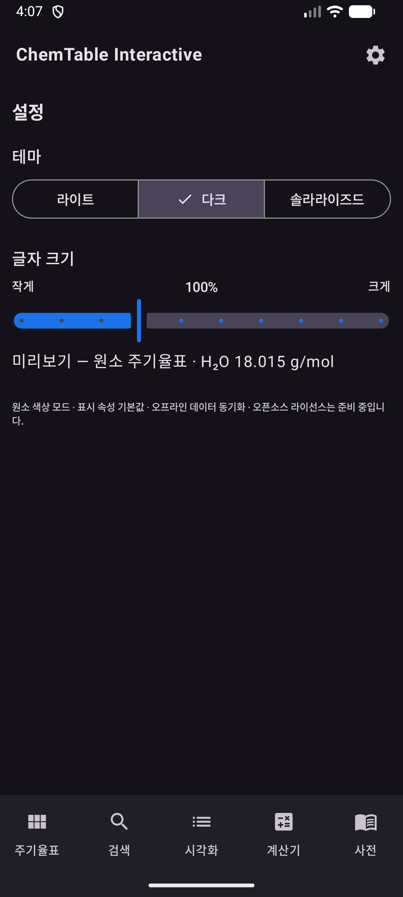
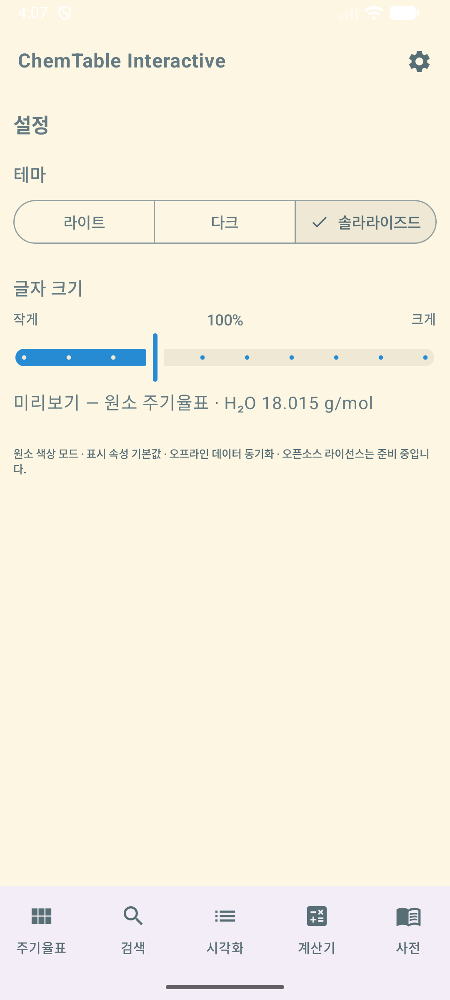

<!-- BRAND_REFRESH_2026_08_25 -->
<div align="center">

# ⚛️ ChemTable Interactive

### The periodic table, fully on-device.

**A polished Android chemistry workspace for exploring elements, isotopes, properties, formulas, notes, visualizations, and molecule-building challenges without a network connection.**


[Explore the features](#what-is-inside) · [Build it](#build-and-verify) · [Screenshots](#screenshots) · [Full technical reference](README.technical.2026-08-25.md)

</div>

---

> **No login. No cloud dependency. No “content unavailable” screen when the network disappears.**

ChemTable Interactive bundles its element, isotope, glossary, and recipe datasets in the APK, seeds them into Room on first launch, and keeps every core learning path on-device.

## What is inside

| Mode | Experience |
|---|---|
| **Explore** | Zoomable periodic table, element details, isotope data, abundance, thermal, crystal, electron, and safety properties. |
| **Find** | Search by name, symbol, atomic number, ranges, stability, decay filters, and sorting. |
| **Calculate** | Parse molecular formulas with parentheses, hydrates, and charges; retain local history. |
| **Learn by doing** | Compare properties, inspect heatmaps, keep notes, browse glossary links, and discover molecules on selectable 4×4, 5×5, or 6×6 Classic boards. |

## Product flow



## Screenshots

| Periodic table | Element detail | Calculator |
| :---: | :---: | :---: |
|  |  |  |

| Glossary | Dark theme | Solarized theme |
| :---: | :---: | :---: |
|  |  |  |

## Build and verify

Requirements:

- JDK 21
- Android SDK with compileSdk 35
- Gradle 9.0 / AGP 8.13.0
- Kotlin 2.1.10

```bash
./gradlew assembleDebug
./gradlew testReleaseUnitTest
./gradlew assembleRelease
```

Full repository gate:

```powershell
.\scripts\verify.ps1
```

or:

```bash
bash scripts/verify.sh
```

## Offline-first contract

- Core screens do not require a network.
- Unknown or unavailable values render as **N/A** rather than fabricated content.
- User notes and calculator history remain local.
- Bundled educational data is versioned with the app.
- Interactive runtime verification still requires a device or emulator. Focused `androidTest` coverage exercises Classic board dimensions, gesture dispatch, accessibility semantics, and the Room 6→7 migration.

The Classic mini-game keeps 4×4 as its default, stores the preferred board size locally, and scopes session scores by board size. See [the P1 variable-board foundation note](docs/p1-variable-board-foundation.md) for the data and compatibility contract.

## Full technical reference

The original detailed README — including the complete feature list, project layout, requirements, data policy, and license notes — is preserved unchanged at:

**[README.technical.2026-08-25.md](README.technical.2026-08-25.md)**

## License

MIT. Third-party Android and Gradle dependencies remain under their respective licenses.
